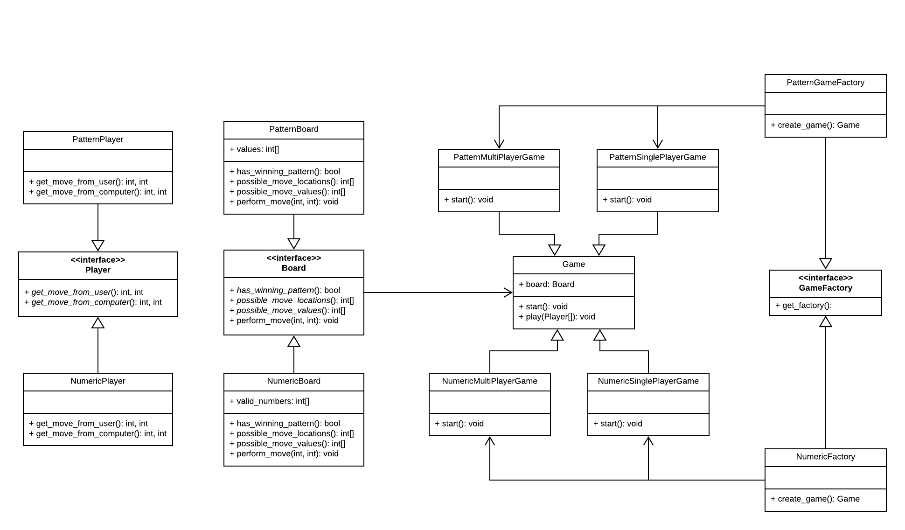

# Tic-Tac-Toe

## Design

### UML

### Initializing the game

Abstract Factory design pattern is used to get the correct `Game` instance from the user. `NumericFactory` or `PatternFactory` is returned based on the `GameType` input by the user. The SinglePlayer or Multiplayer instance is returned based on the GameMode input by the user.

Extensibility is achieved by implementing a new Factory in case of a new `GameType`.

### Game Logic

The `Game` abstract class implements a `play()` method that performs the game logic. The moves and the values are determined by the `Player` and `Board` instances that are passed into the `Game`.

When a new `GameType` or `GameMode` is required, the developer has to only subclass the `Player` and `Board` classes and implement the abstract methods.

The main methods that needs to be implemented are:

| Method | Description |
|--|--|
| `has_winning_pattern()` | This method returns True in case the Board has a winning pattern. |
| `get_moves_from_player()` | Prompts the user for the moves and the values. |
| `get_moves_from_computer()` | Implements the AI logic. |

### Single Player Mode

The implementation of the AI logic chosen is random placement. A random location and a random value (in case of Numeric mode) from a list of possible moves, values is chosen.